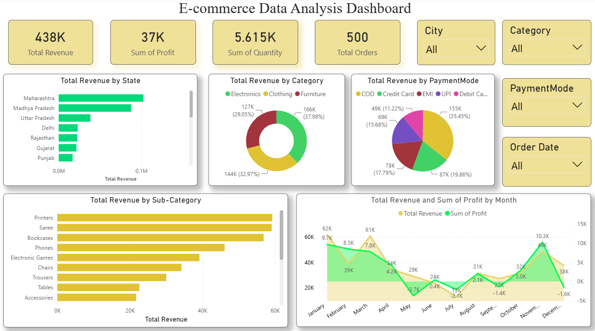

# 🛒 E-commerce Data Analysis Dashboard

An interactive **Power BI** dashboard built on Indian e-commerce sales data, giving a complete view of revenue, profit, and order trends across states, categories, and payment modes.

---

## 📌 Overview

This dashboard analyzes **1,500 order line-items** to understand where revenue comes from, which categories/sub-categories perform best, how profit fluctuates month-on-month, and how customers prefer to pay.

## 📊 Key Metrics (KPIs)

| Metric | Value |
|---|---|
| Total Revenue | **438K** |
| Sum of Profit | **37K** |
| Sum of Quantity | **5.615K** |
| Total Orders | **500** |

## 🔍 Visuals Included

- **Total Revenue by State** — Bar chart showing top-performing states (Maharashtra and Madhya Pradesh lead the list).
- **Total Revenue by Category** — Donut chart split across Electronics (37.98%), Clothing (32.97%), and Furniture (29.05%).
- **Total Revenue by Payment Mode** — Pie chart comparing COD, Credit Card, EMI, UPI, and Debit Card usage.
- **Total Revenue by Sub-Category** — Bar chart ranking sub-categories like Printers, Saree, Bookcases, and Phones.
- **Total Revenue & Sum of Profit by Month** — Combo line/area chart tracking monthly revenue vs. profit trend (including loss months like May and September).
- **Slicers** — City, Category, Payment Mode, and Order Date filters for interactive drill-down.

## 🗂️ Dataset

**File:** `Ecommerce_Data.csv` (1,500 rows)

| Column | Description |
|---|---|
| Order ID | Unique order identifier |
| Order Date | Date of purchase |
| CustomerName | Name of the customer |
| State / City | Customer location |
| Amount | Revenue from the order line |
| Profit | Profit earned |
| Quantity | Units sold |
| Category | Product category (Electronics, Clothing, Furniture) |
| Sub-Category | Detailed product type (Phones, Saree, Chairs, etc.) |
| PaymentMode | Mode of payment (COD, UPI, EMI, Credit/Debit Card) |

## 🛠️ Tools Used

- **Power BI Desktop** — Dashboard design, DAX measures, data modeling
- **Power Query** — Data cleaning and transformation
- **DAX** — Calculated KPIs (Total Revenue, Sum of Profit, Sum of Quantity, Total Orders)

## 📈 Key Insights

- Maharashtra and Madhya Pradesh are the top revenue-generating states.
- Electronics is the highest-earning category, closely followed by Clothing.
- COD and Credit Card are the most preferred payment modes.
- Profit dipped into negative territory in May and September, despite steady revenue — worth investigating for cost/discount spikes.
- November recorded the highest profit spike (10.3K) alongside strong revenue (40K).

## 🚀 How to Use

1. Open the `.pbix` file in Power BI Desktop.
2. Use the **City**, **Category**, **PaymentMode**, and **Order Date** slicers to filter the view.
3. Hover over charts for detailed tooltips.

---
👤 **Author:** Harmant (Harendra Mani Tripathi)
🔗 [GitHub](https://github.com/Harmant05) • [LinkedIn](https://linkedin.com/in/harmant)
